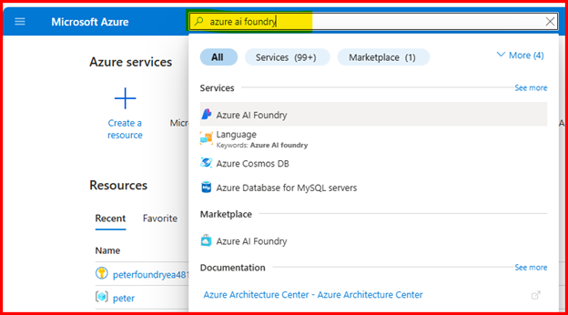

Installing the solution involves the steps below.

### Import the Solution

Download the latest release.

[https://github.com/v7herman4/copilotstudio-and-azure-evaluation-service/releases](https://github.com/v7herman4/copilotstudio-and-azure-evaluation-service/releases)

Navigate to your Power Platform Environment where you’d like to import this solution.

Click on “Solutions” and “Import Solution”.

Select your solution file from your downloaded folder and import it.

### Create Azure AI Foundry Evaluation Service

In order to create the Azure AI Foundry Evaluation Service, you must have a valid Azure Subscription.

Navigate to portal.azure.com

Search for “azure ai foundry” in the search box and click on it from the results.

Click on “Create Resource”
