Installing the solution involves the steps below.

### Import the Solution

Download the latest release.

[https://github.com/v7herman4/copilotstudio-and-azure-evaluation-service/releases](https://github.com/v7herman4/copilotstudio-and-azure-evaluation-service/releases)

Navigate to your Power Platform Environment where you’d like to import this solution.

Click on “Solutions” and “Import Solution”.

Select your solution file from your downloaded folder and import it.

### Create Azure AI Foundry Evaluation Service

In order to create the Azure AI Foundry Evaluation Service, you must have a valid Azure Subscription.

Navigate to portal.azure.com

Search for “azure ai foundry” in the search box and click on it from the results.

Click on “Create Resource”
  

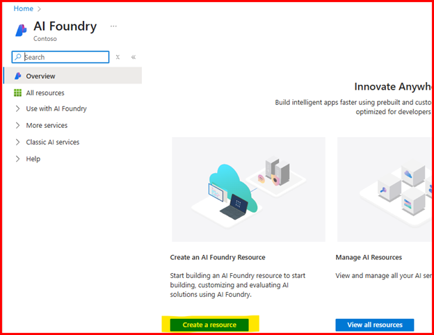

Select a valid Subscription

Select (or create) a new Resource group.

For the “Name”, enter a name with no spaces.

We recommend selecting “East US 2” for the region. For a list of all supported regions see this article: [Risk and safety evaluators for generative AI - Azure AI Foundry | Microsoft Learn](https://learn.microsoft.com/en-us/azure/ai-foundry/concepts/evaluation-evaluators/risk-safety-evaluators#azure-ai-foundry-project-configuration-and-region-support)

For the “Default project name”, enter in a project name with no spaces.

  

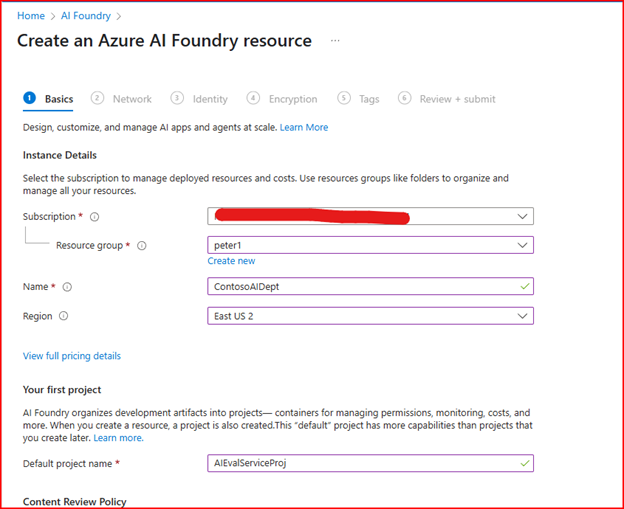

On the “Network” tab, leave the selection “All networks” and click “Next”.

  

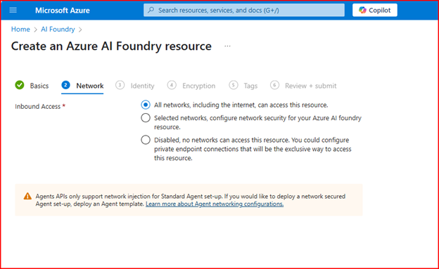

On the “Identity” tab, leave the “System Assigned” selection and click “Next”

Note: If other Azure users need to interact with this AI Project please see the message in the blue message box.

  

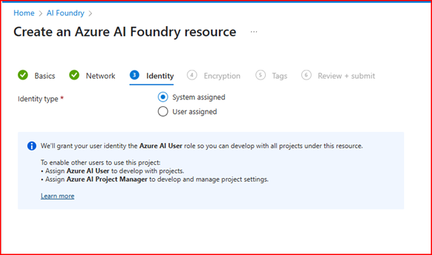

On the “Encryption” tab, leave the check box unchecked and click “Next”

  

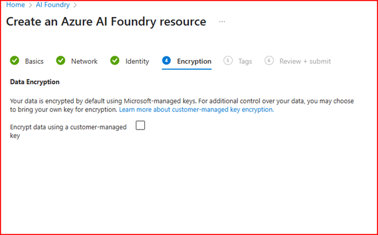

On the “Tags” tab, click “Review and Create”

Azure will begin deploying you Azure AI Foundry project. Please note this may take several minutes.

  

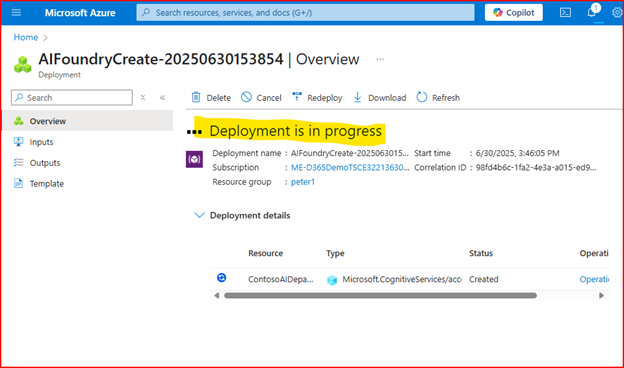

Once the deployment is complete click “Go to resource”

  

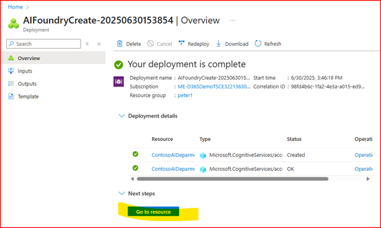

On the resource page, click on “Go to Azure AI Foundry portal”.

  

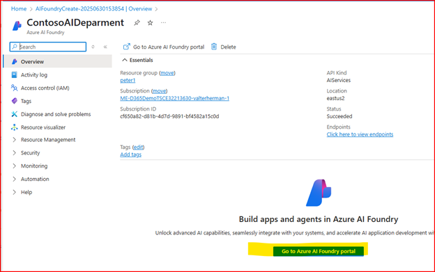

You will copy two URLs needed for setting up your Custom Connector.

From the “Overview” tab, on the sub-section “Azure AI Services”, copy the path from “Azure AI Services endpoint”. This will be used for the “Host” value in your custom connector. Note: do not include “https://” prefix.

  

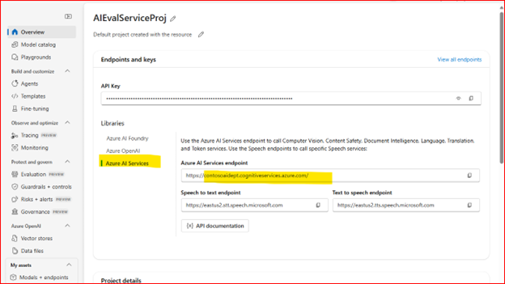

From the “Overview” tab, on the sub-section “Azure AI Foundry”, copy the path from the text box “Azure AI Foundry project endpoint” starting with “/api/projects/” . This will be used for the “Base URL” in your custom connector.

  

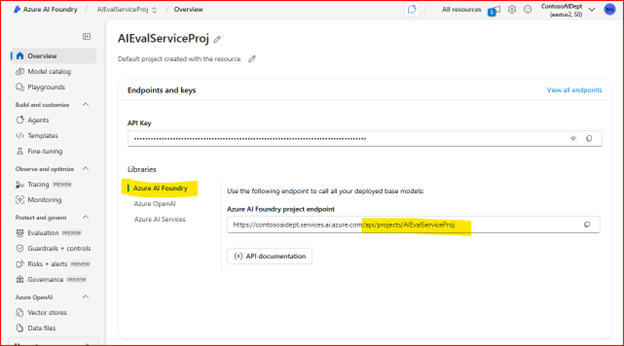

You have successfully configured your Azure AI Foundry project for the Evaluation service!

### Create a New Service Principal (App Registration)

It is easiest to update the custom connector and create a new service principal in tandem as they each reference values in the other. Ideally you will have two tabs open for each of the items.

Start with creating the Service Principal in Azure.

Open a new tab and navigate to “portal.azure.com”. From the search bar, search for and click on “Microsoft Entra ID”. Click on “App registrations” and “+ New registration”

  

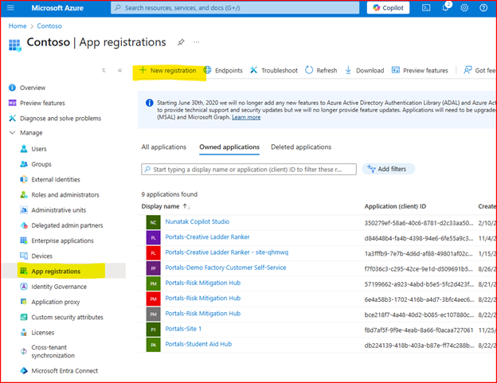

Enter a name into the “Name” text box such as “CPS Eval Service App Reg” and click “Register”.

From the App registration screen, click on “API Permissions”. 

To add “user\_impersonation” permissions for “Azure Machine Learning Services”, click on “Add a permission”, “APIs my organization users” and type in Azure Machine Learning Services. Click on “Azure Machine Learning Services”.

  

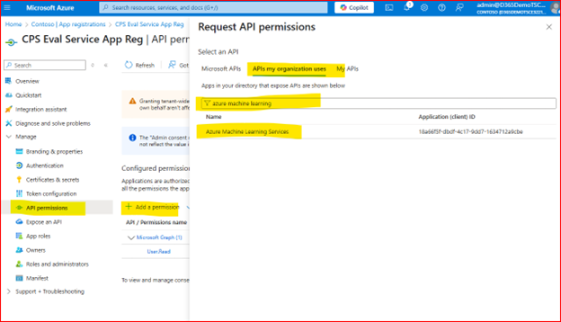

Click on “user\_impersonation” and click on “Add permissions”

  

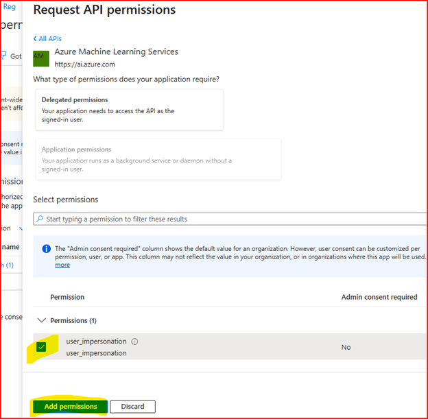

Perform similar steps for “Azure Service Management” however you’ll find “Azure Service Management under the “Microsoft APIs”.

 Ensure “Microsoft Graph” with “User.Read” is already in the list of permissions. If it is not, perform similar steps for “Microsoft Graph” however you’ll find it under “Microsoft APIs” as well. Click on “Delegated permissions”. In the “Select permissions” text box, type in  
user.read . Select “User.Read as shown below. Then click “Update permissions”.

  

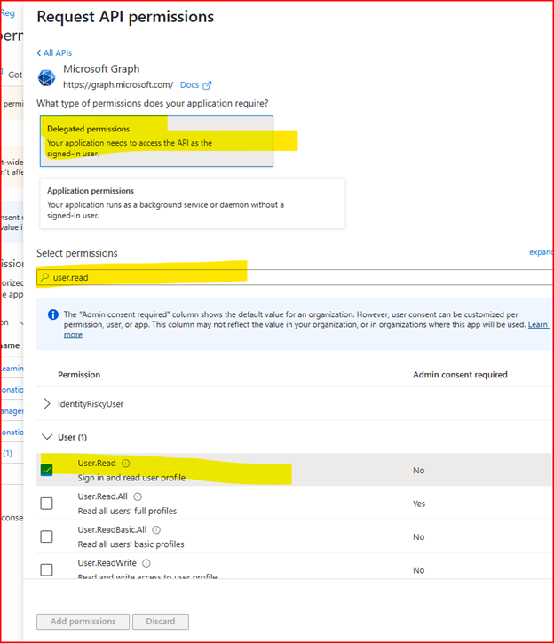

Your resulting permissions should look like so:

  

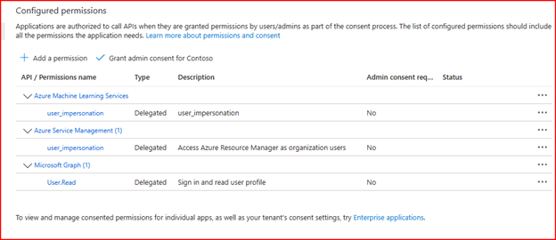

Next add a “Client Secret”. Click on “Certificates & secrets”. Click “+ New client secret”. Enter in a description and press “Add”.

  

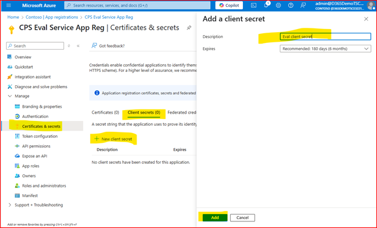

Copy the “Value” (not the “Secret ID”) to a notepad. Do NOT copy or use the “Secret ID”.

  

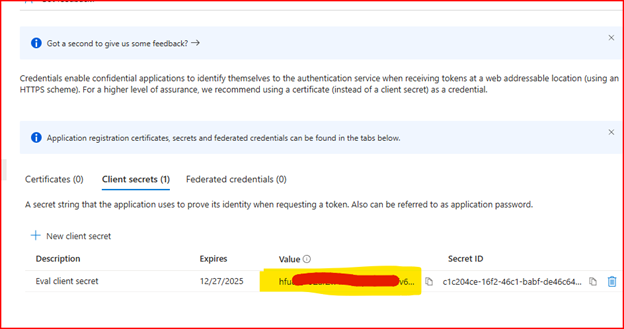

Click on “Overview” and copy the “Application (client) ID to a notepad.

  

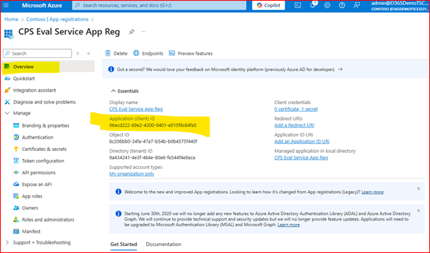

Keep this tab open and open a new tab for the next section.

### Configure the Custom Connector

Next we will configure the custom connector that was imported with the solution. This configuration will allow the connector to use the evaluation service we’ve configured.

In the Power Platform click into the solution imported in the section [Import the Solution](https://microsoft.sharepoint.com/teams/CopilotStudioCollaborations-ObservabilityServicewithCopilotStudioagents/Shared%20Documents/GitHub%20Repo%20Post.docx#_Import_the_Solution).

Click on “Custom Connectors”, then for the “CPS Azure Evaluation Service” connector, click the three dots and “Edit”.

  

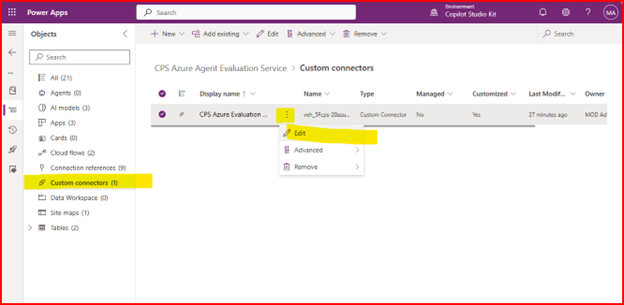

Update the values for “Host” and for “Base URL” using the values from the section [Create Azure AI Foundry Evaluation Service](https://microsoft.sharepoint.com/teams/CopilotStudioCollaborations-ObservabilityServicewithCopilotStudioagents/Shared%20Documents/GitHub%20Repo%20Post.docx#_Create_Azure_AI).

Using the path copied from the “Azure AI Services endpoint” when creating the Azure AI Foundry project, paste it into the “Host” textbox. Do not include “https://” prefix or the trailing forward slash.

e.g. contosoaidept.cognitiveservices.azure.com

Using the path copied from the text box “Azure AI Foundry project endpoint” paste it into the “Base URL”. Ensure you include the forward slash prefix. Only use the text starting with “/api/projects/” . Add “/evaluations” to the end of the text.

                e.g. /api/projects/AIEvalServiceProj/evaluations

Click “Security” from the bottom-right corner to proceed.

  

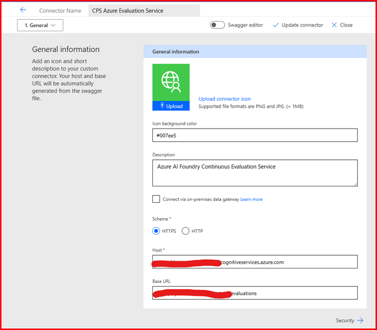

Select “OAuth 2.0” from the “Authentication type” drop-down.

Using the “Application (client) ID” and “Value” from the Service Principal creation step, enter in the “Client ID” and “Client secret”.

Update the “Authorization URL”, “Resource URL” and “Scope” as shown below.

Click the copy icon for the “Redirect URL” as you will need it to update the Service Principal

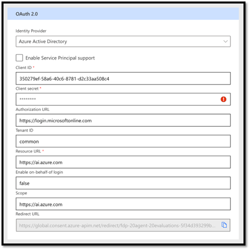

Navigate back to the tab where you have the Service Principal (App Registration) open. Click on “Authentication”, “+Add a platform” and then “Web”.

  

From the “Redirect URI” on the custom connector, paste the value into the “Redirect URIs” and click “Configure”.

  

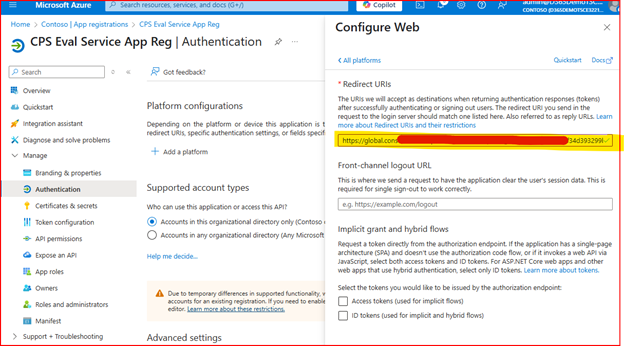

Close the tab for the App Registration, you are finished configure the Service Principal!

Back on the tab with the custom connector, click on “Update connector” and then “Close”.

  

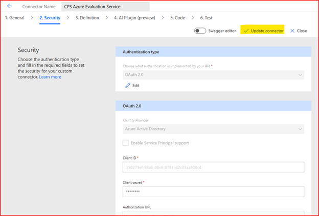

You are finished configuring the custom connector!

### Configure Other Power Platform items

### Share the Canvas App

The Power BI report contains an embedded Canvas App that must be shared with all users of the Power BI report. In order to share the app named “Prompt Response App PBI” with all users who will consume the report. For instructions on how to share a Canvas App see this article:

[Share a canvas app with your organization - Power Apps | Microsoft Learn](https://learn.microsoft.com/en-us/power-apps/maker/canvas-apps/share-app)

Note that “Co-owner” is not required, instead share with “User” privileges.

### Install and Configure the Power BI Report

Download the Power BI report “CPS Evaluation Service Reporting vX.pbi” from the latest release in the GitHub repo.

Open the report with Power BI desktop and connect it to your Dataverse environment where the solution is installed.

Publish the Power BI report.

Configure the Power BI data source refresh.

Share the Power BI report with your target audience.
